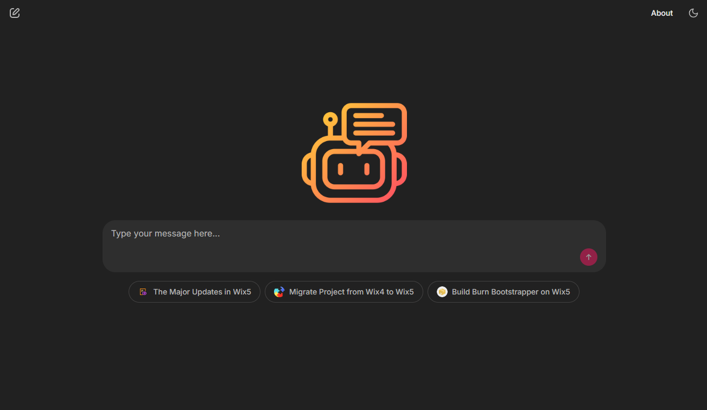
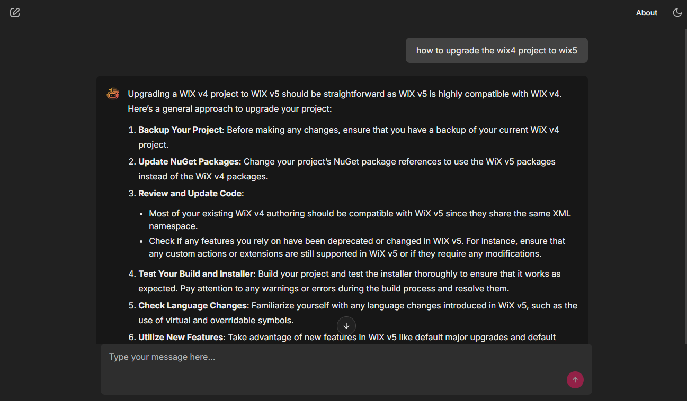
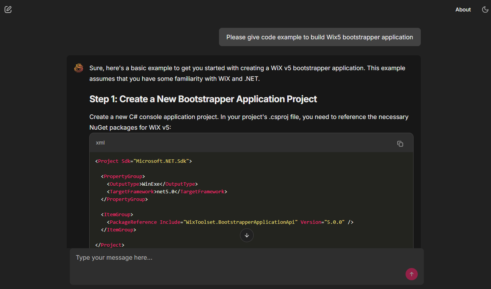

## A Conversational RAG Chatbot

This is a converstaion RGA Chatbot which built on `LangChain`, `Chainlit`, `FAISS` and `Azure OpenAI`. Using Wix official upgrade documents for knowledge source documents. The documents source is under documents folder of project. You can change it to any other source of documents and then update the prompts in the code. 



## How to run the code

### Python Environment Setup
To run the code, you need to have `Python 3.12` or higher installed on your system. You also need to have `pip` installed. You can download and install Python from the official website.https://www.python.org/downloads/

Once you have Python installed, you can create a virtual environment using the following command:

```
python -m venv env
```

This will create a virtual environment named `env` in the current directory. Activate the virtual environment using the following command:

#### Windows
```
env\Scripts\activate
```

#### Linux/MacOS
```
source env/bin/activate
```

This will activate the virtual environment.

### Install Required Packages

To install the required packages, run the following command:

```
pip install -r requirements.txt
```

This will install all the required packages.

### Create `.env` file 

Create a `.env` file in the root directory of the project and add the following variables which is Azure OpenAI API key, endpoint and deployment names.

```
AZURE_OPENAI_ENDPOINT=
AZURE_OPENAI_API_KEY=
AZURE_OPENAI_CHAT_DEPLOYMENT_NAME=
AZURE_OPENAI_CHAT_DEPLOYMENT_VERSION=
AZURE_OPENAI_ADA_EMBEDDING_MODEL_NAME=
AZURE_OPENAI_ADA_EMBEDDING_DEPLOYMENT_NAME=
AZURE_OPENAI_ADA_DEPLOYMENT_VERSION=
```

### Run the Code

To run the code, run the following command:

```
chainlit run app.py
```

### Screenshot



